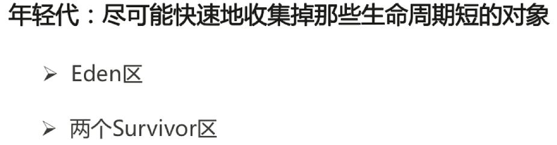

# Creational Design Pattern

## Factory Pattern 工厂模式

* 简单工厂: 由一个工厂对象决定创建出哪一种产品类的实例

* 定义一个创建对象的接口, 但让实现这个接口的类来决定实例化哪个类, 工厂方法让类的实例化推迟到子类中进行

## Abstract Factory Pattern 抽象工厂模式

* 提供一个创建一系列相关或者相互依赖对象的接口
* 无需指定他们具体的类
* 便于创建产品族, 而工厂模式侧重于创建产品等级

## Singleton Pattern 单例模式

* 保证一个类仅有一个实例, 并提供一个全局访问点
* 私有构造器
* 线程安全
* 延迟加载
* 序列化和反序列化
* 反射

## Prototype Pattern 原型模式

* 指原型实例指定创建对象的种类, 并且通过Copy这些原型创建新的对象
* 注意深克隆和浅克隆

## Builder Pattern 建造者模式

* 将一个复杂对象的构建, 与它的表示分离, 使得同样的构建过程可以创建不同的表示
* 用户只需指定需要建造的类型就可以得到它们, 建造过程及细节不需要知道

